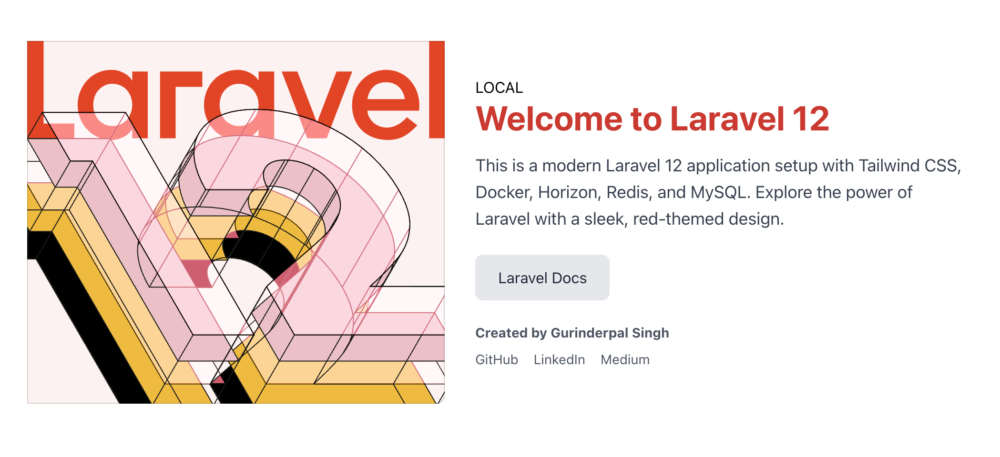

# Project Setup - Laravel 12 dockerize with multi env

This guide provides instructions for setting up the project in different environments (local, stage, prod) using Docker Compose and Laravel. The codebase remains the same across environments, with only the database and configuration files changing.



## Environments
The project supports three environments:
- **Local**: Uses `docker-compose.yml`
- **Stage**: Uses `docker-compose.stage.yml`
- **Prod**: Uses `docker-compose.prod.yml`

Each environment has its own `.env` file:
- `src/.env.local` for local
- `src/.env.stage` for stage
- `src/.env` for prod

## Setup Instructions

### Local Environment Setup
1. Run the following commands to set up the local environment:
   ```bash
   docker compose -f docker-compose.yml up -d --build
   docker compose -f docker-compose.yml exec app composer install
   docker compose -f docker-compose.yml exec app php artisan key:generate
   docker compose -f docker-compose.yml exec app php artisan migrate
   ```
2. Open [http://localhost:8003/](http://localhost:8003/) in a browser.
3. Expected UI: See `docs/local-screenshot.png`.

### Stage Environment Setup
1. Run the following commands to set up the stage environment:
   ```bash
   docker compose -f docker-compose.stage.yml up -d --build
   docker compose -f docker-compose.stage.yml exec app composer install
   docker compose -f docker-compose.stage.yml exec app php artisan key:generate
   docker compose -f docker-compose.stage.yml exec app php artisan migrate
   ```
2. Open [http://localhost:8002/](http://localhost:8002/) in a browser.

### Production Environment Setup
1. Run the following commands to set up the prod environment:
   ```bash
   docker compose -f docker-compose.prod.yml up -d --build
   docker compose -f docker-compose.prod.yml exec app composer install
   docker compose -f docker-compose.prod.yml exec app php artisan key:generate
   docker compose -f docker-compose.prod.yml exec app php artisan migrate
   ```
2. Open [http://localhost:8001/](http://localhost:8001/) in a browser.

## Important Notes
- **Codebase**: The codebase remains the same across all environments. Only the database and `.env` files differ.
- **Git Branches**: It’s best practice to switch to the appropriate Git branch for each environment.
- **Resource Customization**: Each environment uses a different `docker-compose` file, allowing resource customization (e.g., including Adminer in local).
- **Credentials**: All credentials for resources are defined in the respective `.env` files in the `src/` directory.

## Environment File Handling
The Laravel application dynamically loads the appropriate `.env` file based on the `APP_ENV` variable. This is configured in `src/bootstrap/app.php`:

```php
// Get environment name from APP_ENV
$env = env('APP_ENV_FILE', 'local');

// Determine the environment-specific .env file
$envFile = ".env.$env";

// Load the environment file if it exists
$basePath = dirname(__DIR__);
if (file_exists("$basePath/$envFile")) {
    $dotenv = Dotenv\Dotenv::createImmutable($basePath, $envFile);
    $dotenv->safeLoad();
}
```

## Setting Up a New Environment
To create a new environment (e.g., `newenv`):
1. Create a new `docker-compose.newenv.yml` file by copying `docker-compose.stage.yml`.
2. Replace all instances of `stage` with `newenv` in the new file.
3. Create a new `.env.newenv` file in the `src/` directory and register all necessary variables.
4. Run the following commands:
   ```bash
   docker compose -f docker-compose.newenv.yml up -d --build
   docker compose -f docker-compose.newenv.yml exec app composer install
   docker compose -f docker-compose.newenv.yml exec app php artisan key:generate
   docker compose -f docker-compose.newenv.yml exec app php artisan migrate
   ```
5. Open the application in a browser at `http://localhost:{new_port}/`, where `{new_port}` is the port defined in `docker-compose.newenv.yml`.